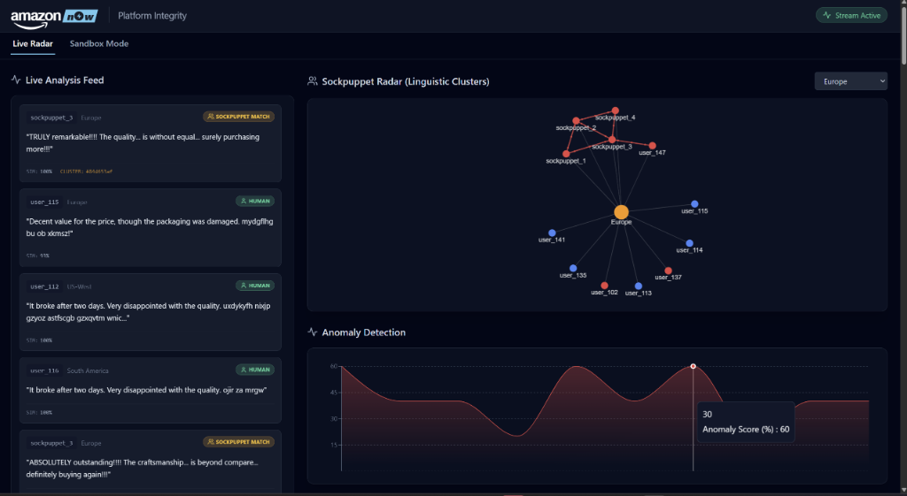
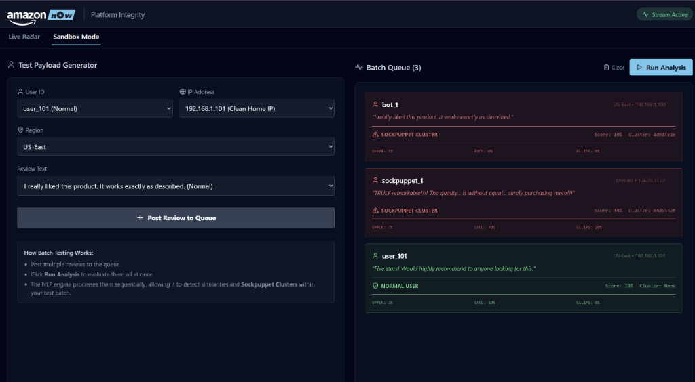

# Amazon Now: Prime Suspect

An advanced Machine Learning and NLP-driven simulation platform designed to detect and visualize automated review bombing, bot networks, and sockpuppet farms in real-time.

## The Problem
Modern e-commerce platforms face increasingly sophisticated fraudulent actors. While traditional spam bots are easily caught by rate-limiting, modern "sockpuppet farms" use distinct user accounts, rotating IPs, and regional coordination to artificially inflate or tank product ratings. **Prime Suspect** isolates these actors by analyzing linguistic footprints and behavioral metadata.

## Machine Learning & NLP Architecture

### Stylometric Feature Extraction
Rather than relying purely on keyword blocklists, the engine analyzes the *structural* linguistic fingerprint of every review:
- **Uppercase Density:** Flags aggressive or artificially emphasized text.
- **Punctuation Frequencies (Exclamations/Ellipses):** Identifies highly emotional, manipulative, or poorly translated bot scripts.
- **Length Normalization:** Scales metrics to ensure fair comparison across short and long reviews.

### Bot Detection Model (Isolation)
Independent spam bots are flagged using a heuristic scoring model that generates a `bot_score` based on the density of the stylometric features. If a review crosses a probabilistic threshold, it is isolated and flagged as a "High Prob Bot", preventing its sentiment from affecting the product rating.

### Sockpuppet Clustering (Pattern Matching)
The core of the NLP engine is its clustering algorithm. It maintains a rolling history of recent profiles and compares incoming data against three strict rules:
1. **IP Address Correlation:** Immediate flagging if multiple distinct user IDs operate from the exact same IP.
2. **Exact Text Matching:** Direct string comparison to catch copy-paste farming.
3. **Regional Stylometric Fingerprinting:** If two users in the same region exhibit highly suspicious stylometric markers AND share a structural linguistic similarity (via Cosine Similarity on feature vectors) > 98%, they are probabilistically grouped into a **Sockpuppet Cluster**. 

## Sandbox & Data Simulation
The platform includes a Live Radar that streams simulated e-commerce traffic, assigning mathematically distinct IPs to normal users to prevent false positives (the Birthday Paradox), while intentionally sharing IPs for sockpuppets. The Sandbox mode allows manual injection of customized payloads to test the NLP engine's edge cases.

## Screenshots

### Live Radar Detection

*Real-time force-directed graph visualizing independent users (Blue) and coordinated sockpuppet networks (Red).*

### Sandbox Batch Analysis

*Batch queue demonstrating the NLP engine accurately classifying clean IPs vs. Datacenter IPs based on text features.*
